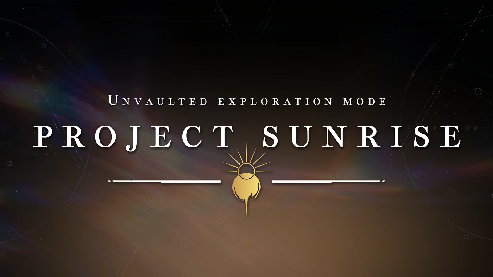
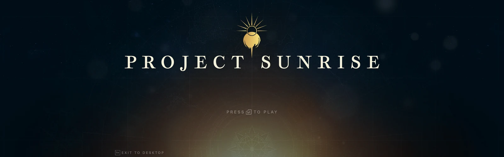

<p align="center">
  
</p>

# Alkahest Sunrise — Alkahest Pre-BL
> **This repository is a fork of [Alkahest](https://github.com/cohaereo/alkahest), created by [cohaereo](https://github.com/cohaereo/cohaereo) with the work of [Alkahest's contributors](https://github.com/cohaereo/alkahest/graphs/contributors). Alkahest Sunrise would not exist without their original architecture, renderer, tooling, and years of work. This fork builds on that foundation for preserved Shadowkeep / Season of Arrivals package support.**


Alkahest Pre-BL is a Windows desktop map viewer and research renderer for
user-supplied Destiny 2 Shadowkeep / Season of Arrivals package files. It lets
you browse preserved destinations, open map bubbles, move through scenes, and
inspect the resources used to build them.

This project is under active development. Rendering can be incomplete, and
some maps or visual effects may not yet match the original game.

## Installation

### Requirements

- 64-bit Windows 10 or Windows 11.
- A Direct3D 11-capable graphics adapter with current drivers.
- Your own legally obtained, preserved Destiny 2 Shadowkeep / Season of
  Arrivals client files. Current live-game packages are not supported.

### Install a release build

1. Open the
   [Alkahest Sunrise releases page](https://github.com/Confetti3/Alkahest-Sunrise/releases)
   and download the latest `alkahest-prebl-*-windows-x64.zip` archive.
2. Optionally download `SHA256SUMS` from the same release and verify the
   archive as described in [Release verification](#release-verification).
3. Extract the entire archive to a writable folder. Keep
   `alkahest-prebl.exe` and `SDL3.dll` together.
4. Run `alkahest-prebl.exe`.
5. At the first-launch prompt, select either:
   - the preserved client folder that contains a `packages` subfolder; or
   - the `packages` folder itself.
6. Use the map browser to select a destination bubble and open it.

The selected package location is remembered for later launches. Game data is
read from that location and is not copied into the application folder.

To update, close the application and replace the extracted program files with
those from the newer release. User settings are stored separately under
`%LOCALAPPDATA%\cohae\alkahest-prebl`.

> If the releases page does not contain a published archive, there is not yet
> a public user build. Do not download unofficial bundles or copies containing
> redistributed game data.

### Troubleshooting

- Confirm that the selected folder belongs to the preserved Shadowkeep /
  Season of Arrivals client, not the current Destiny 2 installation.
- Extract the complete archive; launching the executable without its bundled
  `SDL3.dll` will fail.
- Update the graphics driver if Direct3D 11 initialization fails.
- Startup and renderer diagnostics are written to
  `%LOCALAPPDATA%\cohae\alkahest-prebl\data\alkahest-prebl.log`.
- When reporting a problem, include the application version, map or bubble
  identifier, GPU model, and the relevant log.

## Build from source

Developer builds require the Rust toolchain pinned by `rust-toolchain.toml`.
From a PowerShell prompt in the repository:

```powershell
rustup show
cargo build --profile dist --locked --no-default-features --bin alkahest-prebl
```

The executable and bundled `SDL3.dll` are written to `target\dist`.

Wwise support is opt-in (`--features wwise`) and requires its locally installed
SDK; `crates/rrise` is intentionally excluded from workspace-wide checks.

Shadowkeep diagnostics are off by default. Environment census, sky diagnostics,
sky-object A/B capture, buffer provenance, and global-lighting dependency
manifests run only after their corresponding `render.shadowkeep_*` diagnostic
convar is explicitly enabled.

The `prebl-modern` Windows CI workflow verifies formatting, checks, Clippy,
tests, and the distribution build. Signed `v0.7.*` tags additionally require
tag verification, package smoke testing, SHA-256 checksums, an SPDX SBOM, and
GitHub artifact provenance before a draft release is created.

## Project and artwork

<p align="center">
  
</p>

- **Parent project:** [Destiny 2 Shadowkeep Single Player Exploration Mode](https://github.com/stanuwu/d2-prebl-explorer-info)
  by [stanuwu](https://github.com/stanuwu).
- **Promotional identity and artwork:** Solus —
  [YouTube](https://youtube.com/@solus-yt) ·
  [X / Twitter](https://x.com/solus_yt).
- **Upstream authors and renderer foundation:** [cohaereo](https://github.com/cohaereo/cohaereo),
  creator of [Alkahest](https://github.com/cohaereo/alkahest), and
  [Alkahest's contributors](https://github.com/cohaereo/alkahest/graphs/contributors).
  Alkahest Sunrise is a fork and would not exist without their work.

## Data and affiliation

Alkahest Pre-BL distributes no Bungie game data. Users must supply their own
legally obtained Destiny 2 Shadowkeep / pre-Beyond Light package corpus. The
project is independent and is not affiliated with, endorsed by, or sponsored
by Bungie, Inc.

## Release verification

Each release candidate includes `SHA256SUMS`, `alkahest-prebl.spdx.json`, and a
GitHub artifact attestation.

To verify the downloaded archive checksum in PowerShell, compare this result
with the matching entry in `SHA256SUMS`:

```powershell
Get-FileHash .\alkahest-prebl-v0.7.0-windows-x64.zip -Algorithm SHA256
```

With the [GitHub CLI](https://cli.github.com/) installed, verify its build
provenance with:

```powershell
gh attestation verify .\alkahest-prebl-v0.7.0-windows-x64.zip --repo Confetti3/Alkahest-Sunrise
```

Replace the example version in both commands with the downloaded release
version.

See [THIRD_PARTY_NOTICES.md](THIRD_PARTY_NOTICES.md) for redistributed
components and licensing.

## Resources

- [Translating Art into Technology: Physically Inspired Shading in 'Destiny 2'](https://gdcvault.com/play/1025290/Translating-Art-into-Technology-Physically) -
  Alexis Haraux, Nate Hawbaker (GDC 2018) ([PDF](https://ubm-twvideo01.s3.amazonaws.com/o1/vault/gdc2018/presentations/Haraux_Alexis_Hawbaker_Nate_Translating_Art_Into_Technology.pdf))
- [The Visual Effects Technology of 'Destiny](https://gdcvault.com/play/1025282/The-Visual-Effects-Technology-of) - Ali
  Mayyasi, Brandon Whitley (GDC 2018)
- ['Destiny' Shader Pipeline](https://gdcvault.com/play/1024231/-Destiny-Shader) - Natalya Tatarchuk , Chris Tchou (GDC 2017) ([PDF](https://advances.realtimerendering.com/destiny/gdc_2017/Destiny_shader_system_GDC_2017_v.4.0.pdf))
- [The Destiny Particle Architecture](https://advances.realtimerendering.com/s2017/Destiny_Particle_Architecture_Siggraph_Advances_2017.pptx) -
  Brandon Whitley (SIGGRAPH 2017)
- [Destiny's Multithreaded Rendering Architecture](https://gdcvault.com/play/1021926/Destiny-s-Multithreaded-Rendering) -
  Natalya Tatarchuk (GDC 2015) ([PDF](https://advances.realtimerendering.com/destiny/gdc_2015/Tatarchuk_GDC_2015__Destiny_Renderer_web.pdf))
- [Multithreading the Entire Destiny Engine](https://gdcvault.com/play/1022164/Multithreading-the-Entire-Destiny) -
  Barry Genova (GDC 2015)
- [Lessons from the Core Engine Architecture of Destiny](https://gdcvault.com/play/1022105/Lessons-from-the-Core-Engine) -
  Chris Butcher (GDC 2015)
- [Applied Graphics Research for Video Games](https://advances.realtimerendering.com/destiny/i3d_2015/I3D_Tatarchuk_keynote_2015_for_web.pdf) -
  Natalya Tatarchuk (I3D 2015)
- [Creating Content to Drive Destiny's Investment Game](https://advances.realtimerendering.com/destiny/siggraph2014/bungie_gear_production_siggraph_2014_web_ready.pdf) -
  Natalya Tatarchuk (SIGGRAPH 2014)
- [Powering up Destiny's Level Creation and Rendering with Umbra 3](https://gdcvault.com/play/1017834/Powering-up-Destiny-s-Level) -
  Hao Chen, Otso Makinen (GDC 2013)
- [Destiny: From Mythic Science Fiction to Rendering in Real-Time](https://advances.realtimerendering.com/s2013/Tatarchuk-Destiny-SIGGRAPH2013.pdf) -
  Natalya Tatarchuk (SIGGRAPH 2013)
- [Lighting Research at Bungie](https://advances.realtimerendering.com/s2009/SIGGRAPH%202009%20-%20Lighting%20Research%20at%20Bungie.pdf) -
  Hao Chen, Natalya Tatarchuk (SIGGRAPH 2009)
